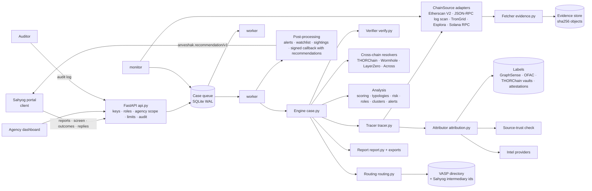

# Architecture

## Overview

**Sahyog is the client (ADR-0019).** It sends wallets and receives recommendations. Officers
approve and send inside Sahyog, and Sahyog reports outcomes and replies back. Anveshak itself
never contacts an intermediary.

A case moves through these stages:

1. **Request.** Subjects (chain, address) are validated by checksum, or detected from the address format.
2. **Trace.** Time-respecting BFS per subject and direction (ADR-0006). Each address history comes
   from a `ChainSource`. Every raw response is stored in the evidence store (ADR-0004), including
   recorded "not found" answers. Bitcoin addresses co-spent with high-activity wallets are not
   expanded (R-COSPEND-SERVICE, ADR-0024), nor are EVM addresses that have sent at least the
   high-activity threshold of transactions (R-BUSY-ACCOUNT, ADR-0026).
3. **Attribute.** Labels (stored, attested, provider) are re-checked for source class (ADR-0005)
   and graded A/B/C/X. Formal denials apply first (G-N1, ADR-0020). Derivations D-COSPEND and
   D-EVM-KEY apply.
4. **Verify.** Every transfer on a reported path is re-checked at transaction level (ADR-0009).
5. **Cross-chain.** Resolvers turn protocol records into links. Each link's recipient is
   confirmed on the destination chain, and confirmed links start continuation traces (ADR-0014, ADR-0022).
6. **Analyse.** Confidence scores, nearest VASPs, typologies, wallet and flow risk, roles, clusters, alerts (ADR-0012, ADR-0013).
7. **Route.** Disclosure, freeze and issuer-freeze drafts, with status by rule (ADR-0010). These
   are served as Sahyog recommendations with intermediary ids and alternative channels (ADR-0019).
8. **Findings.** A deterministic `CaseFindings` object gives the findings hash, the sealed report,
   and JSON/Neo4j/GraphML exports.
9. **Post-process** (outside findings):
   * persisted alerts, with cross-agency matches anonymised;
   * watchlist entries for held funds;
   * cross-case sightings;
   * the signed callback.

   Outcomes and replies arrive later through the API.

## Modules

| Module | Responsibility |
|---|---|
| `chain.py`, `addresses.py` | chains; strict address validation (Base58Check, bech32/m, EIP-55, Solana), Tron hex↔base58, ed25519 on-curve / PDA, chain detection |
| `domain.py` | immutable facts / claims / inferences |
| `evidence.py` | content-addressed store, live and replay fetchers (accepted error statuses recorded), secret redaction incl. endpoint URLs (ADR-0025) |
| `chains/` | `evm.py` (Etherscan), `rpc.py` (JSON-RPC log scan), `evm_common.py`, `tron.py`, `bitcoin.py`, `solana.py`, `memory.py` (tests/demo), `base.py` (interface, caching) |
| `assets.py` + `data/assets.yaml` | verified token registry |
| `labels/` | label store and importers (GraphSense, OFAC, THORChain vaults, attestations incl. denials) |
| `sourcetrust.py` + `data/authorities.yaml` | claimed-versus-earned source class |
| `attribution.py` | grading rules G-* (incl. G-N1), derivations D-* |
| `tracer.py` | search, endpoints, coverage, balances, R-SWEEP, R-COSPEND-SERVICE, R-BUSY-ACCOUNT |
| `verify.py` | path re-verification |
| `crosschain/` | link model; THORChain, Wormhole, LayerZero, Across resolvers |
| `policy.py` + `data/scoring_policy.yaml` | typed, hashed scoring policy |
| `scoring.py`, `risk.py`, `typologies.py`, `profiles.py`, `analysis.py` | confidence, risk and alerts, typologies, roles, clusters and tags, orchestration |
| `routing.py`, `directory.py` + `data/vasp_directory.yaml` | drafts and status rules; VASP / issuer directory |
| `recommendations.py` | `anveshak.recommendation/v1`, Sahyog intermediary mapping, outcome statuses |
| `clients.py` | API clients, roles, agency scope, IP allowlists, rate limits |
| `case.py` | engine, request, findings, findings hash |
| `report.py` + `templates/`, `exports.py`, `graph.py` | HTML report, Neo4j / GraphML, dashboard graph |
| `storage.py`, `service.py`, `gateway.py` | queue and persistence (incl. append-only outcomes and hash-chained audit log), workers / monitor / ingestion / screening / analytics, standalone gateway |
| `benchmark.py` + `benchmarks/` | ground-truth benchmark from public court filings |
| `api.py`, `static/` (vendored Cytoscape.js), `cli.py` | REST API, dashboard, CLI |
| `demo.py` | isolated synthetic scenario (ADR-0018) |
| `tools/mock_sahyog/` | mock Sahyog client (used by the tests; a reference for integrators) |

## Security

- **Input.** Every address is checksum-validated before use. Request models are strict pydantic.
  Request bodies are capped (`ANVESHAK_MAX_BODY_BYTES`).
- **Secrets.** API keys come from the environment only and are redacted from evidence records,
  findings, reports and `/v1/meta`, including keys embedded in JSON-RPC endpoint URLs (ADR-0025).
  Client keys are stored as sha256 only. `.env` is git-ignored.
- **API access (ADR-0023).**
  * Each client has its own key, roles and optional agency scope. Other agencies' cases return
    404, and cross-agency matches are anonymised.
  * Per-client IP allowlists and rate limits.
  * A hash-chained, append-only audit log of every call.
  * TLS and mutual TLS / OAuth for the Sahyog link are terminated at the reverse proxy.
- **Callbacks.** Sent only to hosts on `ANVESHAK_CALLBACK_ALLOWLIST`, over https (SSRF
  protection). Plain http is allowed only for a loopback test receiver. Each callback is
  HMAC-SHA256 signed with `ANVESHAK_CALLBACK_SECRET`.
- **Dashboard.** All server data is escaped before insertion, because label texts come from
  third parties. The API key is kept in session storage for the tab only. No third-party script
  is loaded at runtime.
- **Approvals.** Approvals happen in Sahyog. Standalone approvals are off by default; when
  enabled, they record the officer's name and ID. Synthetic cases can never be approved.
- **Integrity.** Evidence is re-hashed on every read. Reports have SHA-256 sidecars. Findings
  are hashed. Outcome history and the audit log are append-only, enforced by SQLite triggers.

## Running

| Mode | Command |
|---|---|
| Demo (synthetic) | `anveshak demo` |
| Evidence pack (recorded live evidence, replayable offline) | `anveshak trace … --pack DIR`, then `anveshak replay --pack DIR` |
| Live trace (CLI) | `anveshak trace --chain tron --address T… --case-ref "FIR 1/2026"` (EVM chains on RPC log scan also need `--since`) |
| API + dashboard + workers + monitor | `anveshak serve` (then open http://127.0.0.1:8000) |
| API clients | `anveshak clients add --client-id … --role sahyog\|investigator\|supervisor\|auditor [--agency …] [--ip …]` |
| Extra workers | `anveshak worker` (any number, same host) |
| Containers | `docker compose up --scale worker=4` |
| Refresh labels | `anveshak labels import graphsense` · `anveshak labels import ofac` · `anveshak labels import thorchain` |
| Record a VASP reply | `anveshak labels attest … [--denies] [--reply-id …]` or `POST /v1/attestations` |
| Reproduce a case | `anveshak replay <case_id>` |
| Benchmark | `anveshak benchmark` / `anveshak benchmark --replay` |
| Mock Sahyog | `python tools/mock_sahyog/mock_sahyog.py --key … --wallet …` |

## Known limitations

- **Public API caps.** Public APIs impose rate limits and history caps. Busy addresses end
  paths as `high_activity` (reported, not hidden).
- **BNB Chain, Base, OP and Avalanche without a paid key** are traced by a window-limited log
  scan of verified tokens. Native-coin transfers are not visible in logs (ADR-0021).
- **Microsoft Defender on Windows** may kill the process when ransomware labels are loaded and
  EVM RPC calls are made. This is a heuristic false positive (ADR-0021). Linux or Docker is
  the supported deployment.
- **Label coverage** decides how often a VASP is reached. Unlabelled services appear as
  high-activity addresses or unlabelled contracts. Coverage grows through attestations and new
  datasets; the benchmark measures the gap.
- **Uncovered transfer types.**
  * EVM internal transfers are listed, but receipts cannot verify them, so they are marked
    unverifiable (which lowers confidence).
  * TRC-10 tokens and Tron internal TRX transfers are not covered.
- **Cross-chain links** cover four protocols. Bridges without a public lookup API are not linked.
- **Monitoring polls** (default 10 minutes). Push monitoring needs self-hosted nodes (ADR-0015).
- **Scaling.** Rate limits are per API process. The queue is SQLite (single host); PostgreSQL
  is the documented next step.
- **Solana addresses have no checksum.** A typo that still decodes to 32 bytes cannot be detected.
