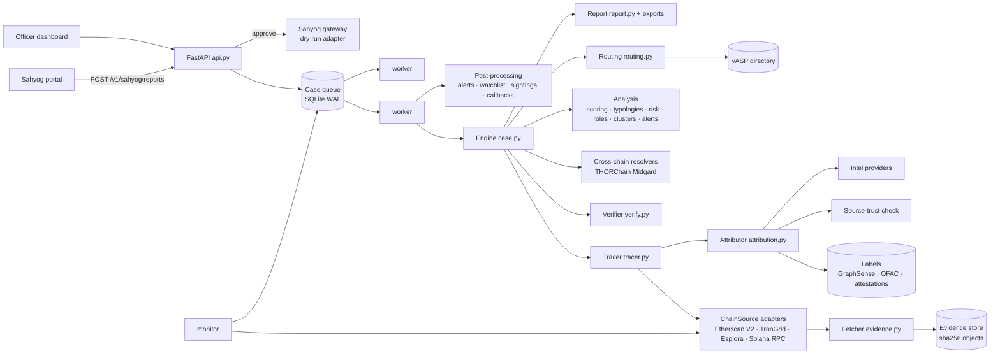

# Architecture

## Overview

A case moves through these stages:

1. **Request.** Subjects (chain, address) are validated by checksum, or detected from the address format.
2. **Trace.** Time-respecting BFS per subject and direction (ADR-0006). Each address history comes
   from a `ChainSource`, and every raw response is stored in the evidence store (ADR-0004).
3. **Attribute.** Labels (stored, attested, provider) are re-checked for source class (ADR-0005) and
   graded A/B/C/X. Derivations D-COSPEND and D-EVM-KEY apply.
4. **Verify.** Every transfer on a reported path is re-checked at transaction level (ADR-0009).
5. **Cross-chain.** Resolvers turn swap records into confirmed links and continuation traces (ADR-0014).
6. **Analyse.** Confidence scores, nearest VASPs, typologies, wallet and flow risk, roles, clusters, alerts (ADR-0012, ADR-0013).
7. **Route.** Disclosure, freeze and issuer-freeze drafts, with status by rule (ADR-0010).
8. **Findings.** A deterministic `CaseFindings` object gives the findings hash, the report, and JSON/Neo4j/GraphML exports.
9. **Post-process** (outside findings). Persisted alerts, watchlist entries for held funds, cross-case sightings, Sahyog callback.

## Modules

| Module | Responsibility |
|---|---|
| `chain.py`, `addresses.py` | chains; strict address validation (Base58Check, bech32/m, EIP-55, Solana), Tron hex↔base58, ed25519 on-curve / PDA, chain detection |
| `domain.py` | immutable facts / claims / inferences |
| `evidence.py` | content-addressed store, live and replay fetchers, secret redaction |
| `chains/` | `evm.py`, `tron.py`, `bitcoin.py`, `solana.py`, `memory.py` (tests/demo), `base.py` (interface, caching) |
| `assets.py` + `data/assets.yaml` | verified token registry |
| `labels/` | label store and importers (GraphSense, OFAC, attestations) |
| `sourcetrust.py` + `data/authorities.yaml` | claimed-versus-earned source class |
| `attribution.py` | grading rules G-*, derivations D-* |
| `tracer.py` | search, endpoints, coverage, balances, R-SWEEP |
| `verify.py` | path re-verification |
| `crosschain/` | cross-chain link model and THORChain resolver |
| `policy.py` + `data/scoring_policy.yaml` | typed, hashed scoring policy |
| `scoring.py`, `risk.py`, `typologies.py`, `profiles.py`, `analysis.py` | confidence, risk and alerts, typologies, roles, clusters and tags, orchestration |
| `routing.py`, `directory.py` + `data/vasp_directory.yaml` | drafts and status rules; VASP / issuer directory |
| `case.py` | engine, request, findings, findings hash |
| `report.py` + `templates/`, `exports.py`, `graph.py` | HTML report, Neo4j / GraphML, dashboard graph |
| `storage.py`, `service.py`, `gateway.py` | queue and persistence, workers / monitor / ingestion / analytics, Sahyog adapter |
| `api.py`, `static/`, `cli.py` | REST API, dashboard, CLI |
| `demo.py` | isolated synthetic scenario (ADR-0018) |

## Security

- **Input.** Every address is checksum-validated before use. Request models are strict pydantic (`extra="forbid"`).
- **Secrets.** API keys come from the environment only. They are redacted from evidence records and index keys. `.env` is git-ignored.
- **API.** An optional `X-API-Key` for all `/v1` routes except health. Callbacks go only to https hosts on
  `ANVESHAK_CALLBACK_ALLOWLIST` (SSRF protection) and are HMAC-SHA256 signed with the API token.
- **Dashboard.** All server data is escaped before insertion. Label texts come from third parties.
- **Approvals.** An officer name and ID are recorded. Synthetic cases can never be approved. Nothing is sent without approval.
- **Integrity.** Evidence is re-hashed on every read. Reports have SHA-256 sidecars. Findings are hashed.

## Running

| Mode | Command |
|---|---|
| Demo | `anveshak demo` |
| Live trace (CLI) | `anveshak trace --chain tron --address T… --case-ref "FIR 1/2026"` |
| API + dashboard + workers + monitor | `anveshak serve` (then open http://127.0.0.1:8000) |
| Extra workers | `anveshak worker` (any number, same host) |
| Containers | `docker compose up --scale worker=4` |
| Refresh labels | `anveshak labels import graphsense` · `anveshak labels import ofac` |
| Record a VASP confirmation | `anveshak labels attest …` or `POST /v1/attestations` |
| Reproduce a case | `anveshak replay <case_id>` |

## Known limitations

- Public APIs impose rate limits and history caps. Busy addresses end paths as `high_activity`
  (reported, not hidden). BNB Chain, Base, OP and Avalanche need a paid Etherscan plan or a
  compatible provider.
- Label coverage decides how often a VASP is reached. Unlabelled services appear as high-activity
  addresses or unlabelled contracts. Coverage grows through attestations and new datasets.
- EVM internal transfers are listed but cannot be verified from receipts (marked unverifiable, which
  lowers confidence). TRC-10 tokens and Tron internal TRX transfers are not covered.
- Cross-chain links come from THORChain only, for now.
- The monitor polls (default 10 minutes). It is not a streaming feed.
- Docker files were not built on the development machine (Docker not installed).
- Solana addresses have no checksum. A typo that still decodes to 32 bytes cannot be detected.
